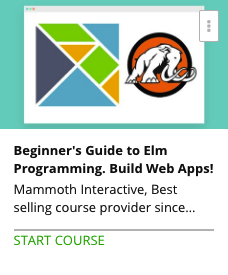

```
Roberto Nogueira  
BSd EE, MSd CE
Solution Integrator Experienced - Certified by Ericsson
```
# Udemy Elm Programming



**About **

Learn everything you need to about the subject of this `Udemy` project.

[Homepage](https://www.udemy.com/beginners-guide-to-elm-programming-build-web-apps/learn/v4/content)

## Topics
```
Section: 1
0 / 3
Chapter 1: Introduction and Installation
[ ] 1. Preface 10:36
[ ] 2. Installing ELM 3:22
[ ] 3. ELM format in PATH 1:44

Section: 2
0 / 11
Chapter 2: Functions
[ ] 4. Intro to Reply and Type 6:21
[ ] 5. Boolean Lists Functions 8:07
[ ] 6. Writing Functions in Elm 3:06
[ ] 7. Partially Applying Functions 5:05
[ ] 8. Invoking a Function from Within Another 4:41
[ ] 9. Pipe Operator 2:33
[ ] 10. If Expressions 3:55
[ ] 11. Tuples 5:53
[ ] 12. Records 5:11
[ ] 13. Types of Records 5:34
[ ] 14. Pattern Matching 5:55

Section: 3
0 / 5
Chapter 3: Attributes
[ ] 15. Writing and Compiling Elm Files 11:42
[ ] 16. Elm File Example (Intermediate) 4:59
[ ] 17. Adding Class Attributes 6:13
[ ] 18. Reactor Intro 8:59
[ ] 19. Adding Complexity to the Example 5:19

Section: 4
0 / 3
Chapter 4: Architecture
[ ] 20. Introduction to Elm Architecture 21:34
[ ] 21. Increasing and Decreasing Size 8:46
[ ] 22. Removing EXCL Marks 5:37

Section: 5
0 / 3
Chapter 5: User Inputs
[ ] 23. User Inputs Example 10:41
[ ] 24. Rendering Input Styles 6:30
[ ] 25. Optimizing Project Code 7:25

Section: 6
0 / 8
Chapter 6: Guessing Games
[ ] 26. Creating a Word Guessing Game 10:05
[ ] 27. Creating Hint Button 8:30
[ ] 28. Improving Functionality 7:49
[ ] 29. Changing States 7:42
[ ] 30. Improving Appearance 5:09
[ ] 31. Refactoring Code 4:18
[ ] 32. Creating a Word List 5:21
[ ] 33. Checking Multiple Words 5:55

Section: 7
0 / 2
Chapter 7: Subscriptions
[ ] 34. Example of the HTML Program Feature in Elm 12:13
[ ] 35. Keyboard Events 6:22

Section: 8
0 / 2
Chapter 8: Commands
[ ] 36. Building a Coin Flip Web App 13:15
[ ] 37. Improving App Appearance 9:23

Section: 9
0 / 3
Chapter 9: Web Sockets
[ ] 38. Building a Chat App 15:37
[ ] 39. Sending Input Text to Multiple Web Tabs 9:49
[ ] 40. Ideas for App Expansion 1:35

Section: 10
0 / 1
Chapter 10: Conclusion
[ ] 41. Final Thoughts 1:34
```
